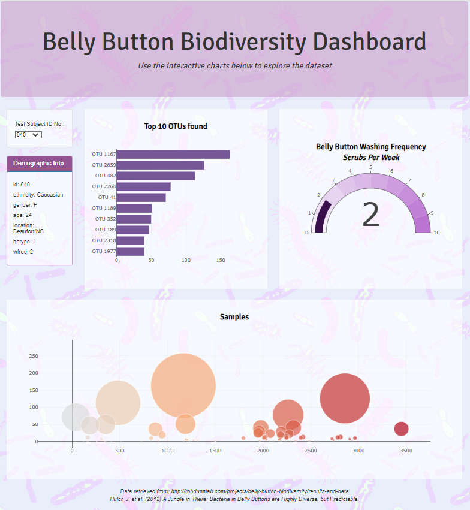

## Plotly dashboard for 'Belly Button Biodiversity' data created with JavaScript, HTML and CSS

[View Dashboard deployed on GitHub Pages](https://justinepile.github.io/belly-button-challenge/)

Dashboard explores the 'Belly Button Biodiversity' dataset which catalogs the microbes that colonize human navels

   
*Data retrieved from: http://robdunnlab.com/projects/belly-button-biodiversity/results-and-data*     
*Hulcr, J. et al. (2012) A Jungle in There: Bacteria in Belly Buttons are Highly Diverse, but Predictable.*
